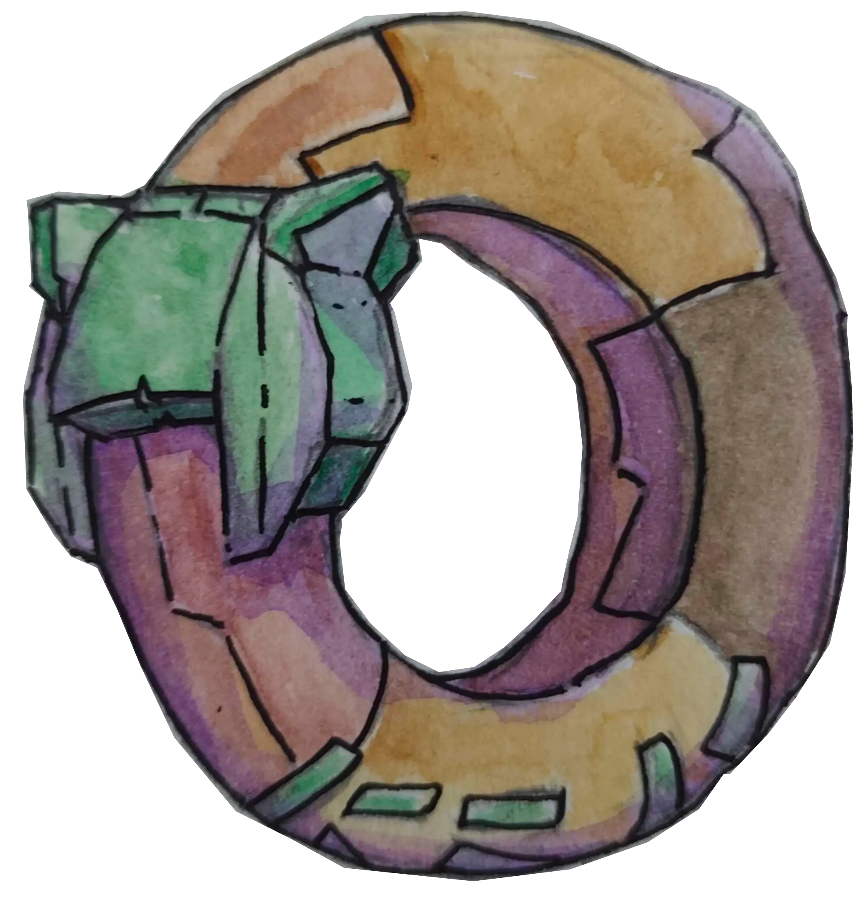

<p align="center">
  
</p>

<h1 align="center">kek's ring</h1>

<p align="center">
  <em>kek's decentralized webring with no central server -- for kek's stuffs</em><br/>
  <sub>membership via CRDT · browser-side gossip · invite tree governance</sub><br/><br/>
  check out the sample at <a href="https://spuun.art/">https://spuun.art/</a>
</p>

<p align="center">
  
  
  
</p>

---

**initialized from [`spuuntries/da-ring`](https://github.com/spuuntries/da-ring) template as example webring.**

## example

check out [`keks-ring`](https://github.com/spuuntries/keks-ring) for a live example of a webring built with da-ring! it's currently running at [spuun.art](https://spuun.art/).

## why

traditional webrings have a central server that manages the member list. if that server goes down or the maintainer walks away, the ring dies. and someone has to babysit it.

da-ring flips this — every member's website _is_ a node. the member list is a CRDT that converges through normal HTTP fetches. no server to maintain, no single point of failure, no one person who has to keep things running.

the invite tree means governance is baked into the data structure itself. no need for voting systems or admin panels — if you invited someone and they turn out to be a problem, you revoke them and their entire subtree goes with them. simple, deterministic, no drama infrastructure.

it's designed for friend groups who want a webring without anyone having to be "the webring person."

## how it works

each ring member's site hosts a `webring.json` file — a set of signed operations (adds, revokes, leaves). the webring widget fetches from multiple members and merges everything client-side. no central server — your website _is_ your node.

membership is governed by an **invite tree**: every member has an inviter, the tree is the authority structure.

### ✦ two tiers

|                 | passive                | active                   |
| --------------- | ---------------------- | ------------------------ |
| **setup**       | paste a `<script>` tag | also host `webring.json` |
| **can invite?** | no                     | yes                      |
| **redundancy**  | reads from actives     | serves state to others   |

most friends just need to be passive. the genesis member (you) is always active.

## quick start

> [!NOTE]  
> This is alrd a fork, so like-- 1-2 is alrd done lol. Ring's alrd initialized. If I've invited u, u can do 3 _or_ 5, depending if someone else invited u.

### 1. fork & configure

fork [`spuuntries/da-ring`](https://github.com/spuuntries/da-ring) on github, or click **Use this template** to create your own repo. then:

```bash
# ↓ change this to your repo's URL
git clone https://github.com/your-username/your-repo-name
cd your-repo-name
npm install
```

edit [`ring.config.ts`](ring.config.ts):

```typescript
export default {
  name: "kek's ring",
  inviteBudget: 2, // invites per member
};
```

### 2. initialize your ring

```bash
npx da-ring init --url https://spuun.art
```

this generates:

- **`webring.json`** — deploy to your site root
- **`.da-ring/keys.json`** — your keypair _(gitignored, keep safe!)_

also add the widget to your own site:

```html
<script
  src="https://spuun.art/keks-ring-widget.js"
  data-ring="https://spuun.art"
></script>
```

> host the built `dist/index.widget.js` on your site or a CDN. here it's been renamed as `keks-ring-widget.js` for simplicity, but you can rename the file into whatever, just change it in the `src` field when you're embedding the widget.

### 3. invite friends

```bash
npx da-ring invite https://friend.site --name "friend"
```

re-deploy your updated `webring.json`, then tell your friend to paste the widget:

```html
<script
  src="https://spuun.art/keks-ring-widget.js"
  data-ring="https://spuun.art"
></script>
```

### 4. build (only after edits)

`npm install` auto-builds everything. you only need to rebuild manually if you change the widget styles or ring config:

```bash
npm run build
```

outputs `dist/index.widget.js` — self-contained widget bundle (~23KB).

### 5. upgrading (passive → active)

a passive member who wants to start inviting people:

```bash
# clone the ring owner's fork (not the upstream template)
git clone https://github.com/spuuntries/keks-ring
cd keks-ring && npm install

# upgrade — pulls state from an active member, generates your keypair
npx da-ring upgrade --ring https://alice.site --url https://spuun.art
```

this generates their own `webring.json` + keypair. deploy both `webring.json` and the widget to your site:

```html
<!-- add this to your site too -->
<script
  src="https://spuun.art/keks-ring-widget.js"
  data-ring="https://alice.site,https://spuun.art"
></script>
```

now you're active — can invite others and contribute to ring redundancy. note the `data-ring` lists multiple bootstrap URLs for better resilience.

## hosting & cors

because the webring works by having browsers fetch `webring.json` from other members' domains, **your web server MUST be configured to send CORS headers** (`Access-Control-Allow-Origin: *`) for the json file.

- **github pages**: usually enables this by default.
- **vercel / netlify**: you must add a `vercel.json` or `netlify.toml` file to your site's root to explicitly add the headers.
- **domain redirects**: if your host automatically redirects your naked domain to `www` (or vice versa), the 308 redirect response often drops custom CORS headers, breaking the fetch. to fix this, ensure the URLs in your `data-ring` script tag point directly to your primary non-redirecting domain.

example `vercel.json` for vercel users:

```json
{
  "headers": [
    {
      "source": "/webring.json",
      "headers": [
        { "key": "Access-Control-Allow-Origin", "value": "*" },
        { "key": "Access-Control-Allow-Methods", "value": "GET, OPTIONS" }
      ]
    }
  ]
}
```

## cli

all commands: `npx da-ring <command>`

| command                                  | description                                                |
| :--------------------------------------- | :--------------------------------------------------------- |
| **`init`** `--url <url>`                 | initialize a new ring                                      |
| **`invite`** `<url> --name <name>`       | invite someone                                             |
| **`revoke`** `<url> [--soft]`            | revoke a member (cascades by default, `--soft` re-parents) |
| **`leave`**                              | leave the ring _(your invitees get re-parented)_           |
| **`upgrade`** `--ring <url> --url <url>` | passive → active                                           |
| **`sync`**                               | pull state from active peers                               |
| **`status`**                             | show ring info and invite tree                             |

**`status` output:**

```
✦ kek's ring (3 members)

  you: https://spuun.art (1/2 invite slots)

  https://spuun.art (genesis, active) [1/2]
  └── https://kekbot.spuun.art kekbot (active) [1/2]
      └── https://lily.spuun.art lily (passive)
```

(this is gona get updated after adding my smol bot pals ok, gime a sec)

## the crdt

the ring state is a **grow-only set of signed operations** (G-Set).

```
merge(a, b) = a ∪ b    // set union — commutative, associative, idempotent
```

each operation is signed with Ed25519 and includes causal dependencies (`seen` op IDs). everyone with the same ops derives the same member list by replaying in causal order.

### operations

| op            | what it does                             | signed by |
| :------------ | :--------------------------------------- | :-------- |
| **genesis**   | creates the ring, sets name + budget     | founder   |
| **add**       | invites a new member                     | inviter   |
| **key-claim** | publishes pubkey (passive → active)      | self      |
| **revoke**    | removes invitee (cascades or re-parents) | inviter   |
| **leave**     | exits, children re-parented to inviter   | self      |

### conflict resolution

- revoke wins over concurrent add for same target
- invite budget enforced at derivation time
- only direct inviters can revoke their invitees
- deterministic ring order via `SHA-256(member URL)`

## governance

the invite tree _is_ the governance:

```
alice (genesis)
├── bob
│   └── carol ← bob can revoke
└── dave     ← alice can revoke
```

- **revoke** cascades: revoking bob also removes carol (unless you use `--soft`, which re-parents carol to alice)
- **leave** re-parents: if bob leaves, carol moves under alice
- no voting, no quorum — the tree is the authority

### key recovery & soft revokes

if a member loses their private key (`.da-ring/keys.json`), they can no longer sign new operations.

to recover, their inviter must use `npx da-ring revoke <url> --soft`. this removes the lost-key member from the ring, but **re-parents all of their invitees** to the inviter (saving innocent members from being nuked).

after the soft-revoke, the inviter can re-invite them using the exact same URL. because da-ring enforces causal signature verification, the member can publish a brand new key for their URL without breaking the past, and attackers cannot use their stolen old key to forge new invites!

## customizing

edit the styles in [`src/widget/render.ts`](src/widget/render.ts) and rebuild. the widget uses shadow DOM so nothing leaks.

```bash
npm run build
```

## architecture

```
src/
├── crdt/           # CRDT engine (isomorphic)
│   ├── ops.ts      # operation types + signing
│   ├── state.ts    # G-Set merge + view derivation
│   └── validate.ts # signature + rule validation
├── crypto/
│   └── keys.ts     # Ed25519 + SHA-256
├── cli/            # CLI commands
│   ├── config.ts   # local state management
│   └── commands/   # init, invite, revoke, leave, upgrade, sync, status
└── widget/         # browser widget (23KB bundle)
    ├── index.ts    # fetch + merge + orchestrate
    └── render.ts   # shadow DOM rendering + styles
```

## license

MIT
